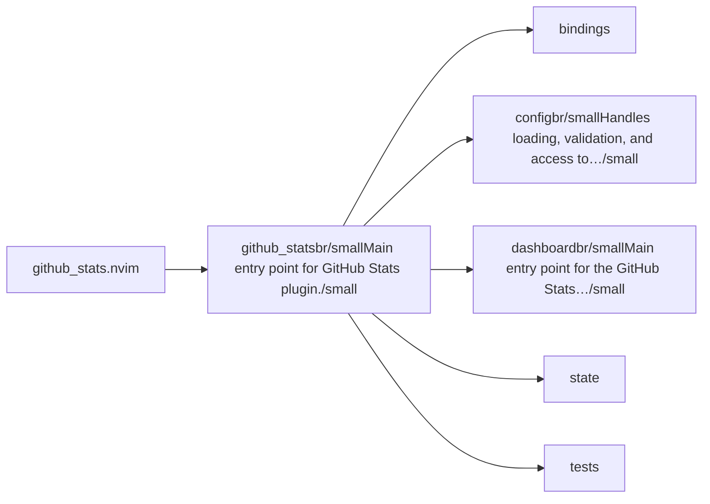
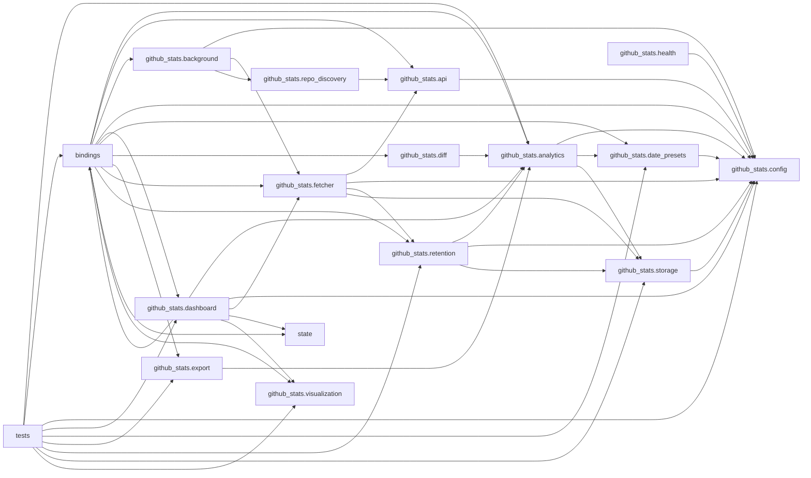

# github_stats.nvim — module map

> **Generated** by `documentation`. Do not edit by hand — run `:DocMap`
> (or `nvim --headless -l scripts/gen_map.lua`) to regenerate.

**4 modules** · 5 namespaces · 41 helper files

The [interactive map](index.html) has filtering, full descriptions and
source links; this page is the version the code host renders directly.

## Namespaces

## Dependencies

Which parts of the tree require which, rolled up to the second level.
The [interactive map](index.html)'s **Deps** view has this per module,
in both directions, with load-time and lazy requires told apart.

## Modules

| Module | Description | Fns | Docs |
|---|---|---|---|
| `github_stats` | Main entry point for GitHub Stats plugin. | 1 | [src](../../lua/github_stats/init.lua) |
| &nbsp;&nbsp;`bindings` |  |  |  |
| &nbsp;&nbsp;&nbsp;&nbsp;`github_stats.bindings.usrcmds` | Central registry for all GitHub Stats user commands, built via lib.nvim.usercmd.composer as a single `:GithubStats <subcommand>` verb. | 2 | [src](../../lua/github_stats/bindings/usrcmds/init.lua) |
| &nbsp;&nbsp;`github_stats.config` | Handles loading, validation, and access to user configuration. | 14 | [src](../../lua/github_stats/config/init.lua) |
| &nbsp;&nbsp;`github_stats.dashboard` | Main entry point for the GitHub Stats dashboard. | 8 | [src](../../lua/github_stats/dashboard/init.lua) |
| &nbsp;&nbsp;`state` |  |  |  |
| &nbsp;&nbsp;`tests` |  |  |  |
| &nbsp;&nbsp;&nbsp;&nbsp;`integration` |  |  |  |

## Drift

7 errors · 2 warnings · 7 info

| Severity | Check | Message |
|---|---|---|
| error | `missing-module-tag` | lua/github_stats/tests/analytics_spec.lua has no ---@module annotation |
| error | `missing-module-tag` | lua/github_stats/tests/config_spec.lua has no ---@module annotation |
| error | `missing-module-tag` | lua/github_stats/tests/dashboard_spec.lua has no ---@module annotation |
| error | `missing-module-tag` | lua/github_stats/tests/date_presets_spec.lua has no ---@module annotation |
| error | `missing-module-tag` | lua/github_stats/tests/export_spec.lua has no ---@module annotation |
| error | `missing-module-tag` | lua/github_stats/tests/integration/dashboard_flow_spec.lua has no ---@module annotation |
| error | `missing-module-tag` | lua/github_stats/tests/retention_spec.lua has no ---@module annotation |
| warn | `doc-references-missing` | docs/ROADMAP/Arch&Coding.md:77 references 'github_stats.txt', but github_stats has no 'txt' |
| warn | `require-not-declared` | requires "github_stats.dashboard.renderer" (line 24), which no file in this tree declares |

7 informational findings

| Check | Message |
|---|---|
| `missing-readme` | lua/github_stats has no README.md |
| `missing-readme` | lua/github_stats/bindings/usrcmds has no README.md |
| `missing-readme` | lua/github_stats/config has no README.md |
| `missing-readme` | lua/github_stats/dashboard has no README.md |
| `unreferenced-module` | github_stats is required by no other file in the tree |
| `unreferenced-module` | github_stats.dashboard.layout is required by no other file in the tree |
| `unreferenced-module` | github_stats.health is required by no other file in the tree |

